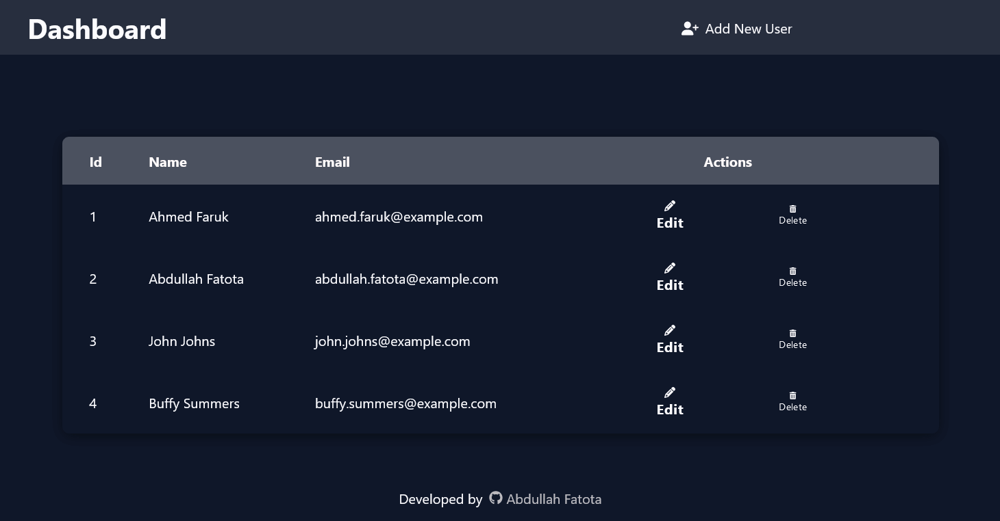

# React Dashboard CRUD

A dark-themed dashboard for users management in React.

## Supported functionality

-   adding a new user
-   deleting an existing user

It allows to add and delete users directly from the table.

To simulate a database, all users are stored in a local `db.json` file.
